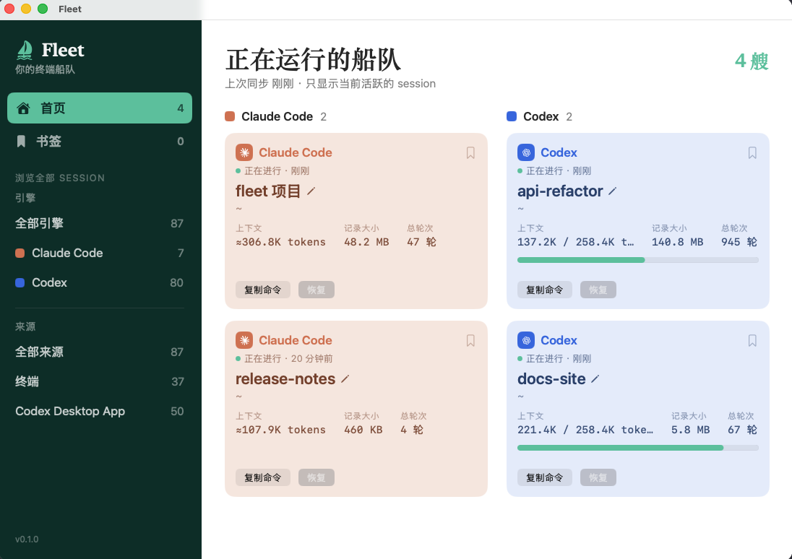

# Fleet

Mac 端菜单栏工具，扫描并展示本机 **Claude Code** / **Codex** 的历史与当前活跃 session——不用再翻终端窗口找回话，不用去记 session ID。



## 功能

- **首页**：只显示当前活跃、来自终端的 session，Claude Code 和 Codex 分栏展示，上下文占用、记录大小、总轮次一眼看到。
- **浏览全部 Session**：按引擎（Claude Code / Codex）和来源（终端 / Codex Desktop App）筛选，支持搜索项目名或路径。
- **书签**：手动关闭前先加书签，避免关掉之后找不回来。
- **重命名**：在 Fleet 里给 session 起个好记的名字，本地持久化，重开也不会丢。
- **一键复制恢复命令**：`claude --resume <id>` / `codex resume <id>`，粘到终端就能接着聊。


## 数据处理说明

- 只读取本机 `~/.claude` 和 `~/.codex` 目录下的 session 记录——项目路径、活跃状态、上下文占用等，用来在这里展示。
- **纯本地，没有网络请求**，不会上传到任何地方；代码里没有引入任何网络库或第三方依赖。
- 重命名和书签保存在 Fleet 自己的本地文件（`~/Library/Application Support/Fleet/`），不会写回 Claude Code 或 Codex。
- 首次启动会有一次性说明弹窗，把以上几点讲清楚再开始扫描。

## 技术方向

原生 SwiftUI，独立菜单栏 App（`LSUIElement`，无 Dock 图标），不常驻后台、不轮询——启动时扫描一次，之后闲置直到下次打开。

- 需求与技术调研：[session-tracker-需求文档.md](./session-tracker-需求文档.md)
- UI 设计稿：[V1](./Fleet-设计稿V1.md)（当前采用）· [V2](./Fleet-设计稿V2.md) · [V3](./Fleet-设计稿V3.md)

## 开发

用 [XcodeGen](https://github.com/yonaskolb/XcodeGen) 生成工程（`Fleet.xcodeproj` 不进库，由 `project.yml` 生成）：

```
xcodegen generate
open Fleet.xcodeproj
```

或直接命令行构建：

```
xcodegen generate
xcodebuild -project Fleet.xcodeproj -scheme Fleet -configuration Debug build
```

## 安装后打不开？

如果是从网上下载的安装包（而不是自己本地编译），macOS 首次打开可能会提示"无法验证开发者"——这是系统的 Gatekeeper 检查，去"系统设置 → 隐私与安全性"里点一下"仍要打开"即可，只需要做一次，以后正常启动不会再提示。

## License

[MIT](./LICENSE)（仅覆盖本项目代码；不适用于下方第三方商标素材）

## 第三方商标声明

Session 卡片中的 Claude / OpenAI 图标为对应公司的官方商标，仅用于标识对应引擎，不代表 Anthropic / OpenAI 对本项目的背书或关联。矢量图取自 Wikimedia Commons 镜像文件：

- Claude：[`File:Claude_AI_symbol.svg`](https://commons.wikimedia.org/wiki/File:Claude_AI_symbol.svg)（CC0）
- OpenAI：[`File:OpenAI_logo_2025_(symbol).svg`](https://commons.wikimedia.org/wiki/File:OpenAI_logo_2025_(symbol).svg)（形状为公有领域，商标权仍归 OpenAI 所有）
